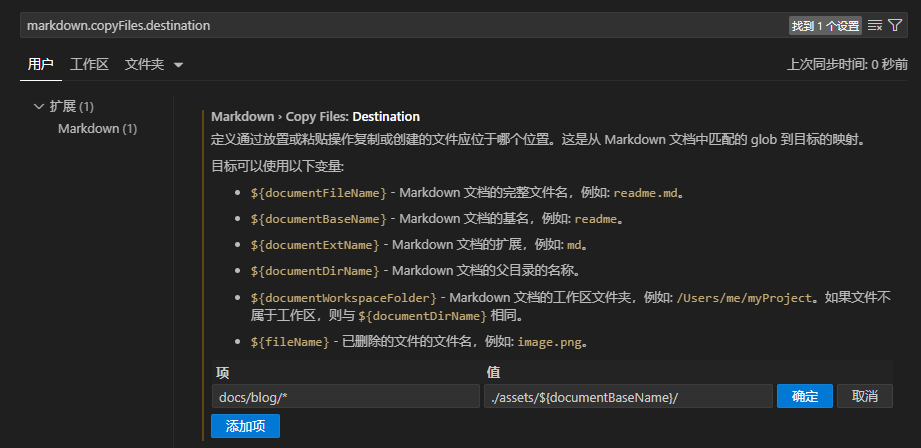

# Vscode 编写 Mardown 时复制图片自动保存到目标文件夹

在使用 Vscode 编写 Markdown 时可以直接复制图片自动生成链接，并将图片生成到文档同级下。当文件多时不方便管理需要将其保存到指定的对应文件夹下。

## 使用 markdown.copyFiles.destination 设置

在设置中搜索 `markdown.copyFiles.destination` 或者自行查找

点击添加项，并输入值即可：

> `项`表示文件的匹配方式，可以使用`*`表示全部 markdown 文件，路径不用关心项目的路径，只要匹配成功即可；  
> `值`表示素材的保存路径，可以使用上方的值来动态生成保存路径，使用斜杠开头表示以项目根目录为开始路径，直接写路径或者以`./`开头则以编辑文件的目录为开始路径；

当前这设置的效果为：

> 在 docs/blog 下的所有 fileName.md 文件中复制图片时将自动保存到 docs/blog/asstes/fileName/下

同时设置多个规则：

> 当设置多个规则时，会从上到小依次匹配文件的路径，并在有匹配成功的情况下第一个满足匹配的路径，没有匹配成功时将复制到文档的同级目录下（默认）。

## 当前 Vscode 版本信息

可在`帮助>>关于`中查看

| 版本            | 1.82.1 (user setup)                      |
| --------------- | ---------------------------------------- |
| 提交            | 6509174151d557a81c9d0b5f8a5a1e9274db5585 |
| 日期            | 2023-09-08T08:45:05.575Z                 |
| Electron        | 25.8.0                                   |
| ElectronBuildId | 23503258                                 |
| Chromium        | 114.0.5735.289                           |
| Node.js         | 18.15.0                                  |
| V8              | 11.4.183.29-electron.0                   |
| OS              | Windows_NT x64 10.0.22621                |
