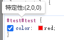
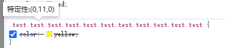

# css 选择器优先级

## 选择器分类与优先级

css 选择优先级共有 3 级（优先级高的在前）：

| 选择器               | 示例             | 优先级    |
| -------------------- | ---------------- | --------- |
| ID 选择器            | #id              | (1, 0, 0) |
| 类选择器：           | .class           | (0, 1, 0) |
| 属性选择器           | [id] [id="test"] | (0, 1, 0) |
| 伪类选择器           | :hover :empty    | (0, 1, 0) |
| 伪元素               | ::after ::before | (0, 1, 0) |
| 标签选择器           | div p            | (0, 0, 1) |
| 通用选择器（通配符） | \*               | (0, 0, 0) |

> 其中通配符（\*）是没有优先级的。关系选择器（+、>、~...）对权重没有影响。

## 权重计算与比较

基于选择器类型，优先级的权重表示为为(lv1，lv2，lv3)：

```css
div.class           /* (0, 1, 1) */
*div.class          /* (0, 1, 1) */
#id.class.class     /* (1, 2, 0) */
.class::after       /* (0, 2, 0) */
.class:empty::after /* (0, 3, 0) */
```

权重依次比较 lv1、lv2、lv3，当分出大小后就不再比较。相同的权重，写在后面的样式属性将会覆盖前面相同样式属性。

> 对于继承的属性，是没有权重的。并且继承会以 dom 树中最近的继承属性值为准。

在很多地方认为优先级中的权重为 100、10 和 1，然后相加得到权重。例如`div.test`的权重为 11。大部分情况可以这样认为，因为一般不会用超过 10 个的统计选择器会引发进位，可以用以下的选择器证明（当然一般不会这样写选择器）：

```css
#test {
  /* 100 or (1, 0, 0) */
  color: red;
}
.test.test.test.test.test.test.test.test.test.test.test {
  /* 110 or (0, 11, 0) */
  color: yellow;
}
```

> 结果为 red ，相同的选择器可以反复添加来提交权重。

### 查看权重

在浏览器调试页面中的元素界面中，将鼠标移动到选择器上可以查看选择器的权重信息。



### 可能混淆的选择器

当选择器中有伪类时，常常会认为触发了伪类就会以伪类的样式为准，其实这其中并没有绝对的覆盖，而是遵守权重覆盖。

> 在比较伪元素的权重时，可以将伪元素的权重去掉，因为作用伪元素的选择器后都是需要加上伪元素选择器的。

```css
/* (0, 2, 1) */
div.test.test {
  color: red;
}
/* (0, 2, 1) */
div.test:first-child {
  color: yellow;
}
/* (0, 2, 0) */
.test:hover {
  color: blue;
}
```

> red = yellow > blue；

## 样式覆盖

当有多个选择器作用于同一个属性时，以权重高的为准。

```css
/* (0, 2, 0) */
.test.test {
  color: yellow;
}
/* (0, 1, 0) */
.test {
  color: red;
}
/* (0, 1, 1) */
div.test {
  color: blue;
}
```

> yellow > blue > red

### 内联样式

位于标签中 style 属性中的样式为内联样式，其优先级高于任何选择器。

```html
<style>
  div#test.test {
    color: red;
  }
</style>
<div id="test" class="test" style="color: blue">test</div>
```

> 结果为 blue

### !important

> > 不到万不得已，不要使用`!important`，这会使样式结构混乱。

在 css 属性后面添加`!important`可以让这个属性的优先级高于任何选择器，当有两个或多个`!important`作用同一个属性时，会以选择器优先级决定。

```css
.test {
  color: red;
}
div {
  color: yellow !important;
}
div.test {
  color: blue !important;
}
```

> blue > yellow > red

在需要覆盖内联样式（或者其他样式）时，可以在属性后加上`!important`来强制覆盖:

```html
<style>
  div#test.test {
    color: red !important;
  }
</style>
<div id="test" class="test" style="color: blue">test</div>
```

> 结果为 red

如果想让内联样式不被覆盖，也可以在内联样式中添加`!important`，但是这样做十分的不友好（当心以后自己骂自己）：

```html
<style>
  div#test.test {
    color: red !important;
  }
</style>
<div id="test" class="test" style="color: blue !important">test</div>
```

> 结果为 blue

## 伪类选择器

一般伪类的权重为(0, 1, 0)，但是也有一些例外，他们通常像函数一样可以追加规则。

### :where()

`:where()`伪类选择器可以接受选择器列表作为参数，将会选择所有能被该选择器列表中任何一条规则选中的元素。权重永远为 (0, 0, 0)。

```css
div:where(.test, #test) {
  color: red;
}
```

> 匹配 class 为 test 或者 id 为 test 的 div 标签，权重都为 div 标签权重：(0, 0, 1)。

### :is()

`:is()`与`:where()`相似，不过`:is()`会带上权重。权重采用参数中最高权重，无论是否匹配到该选择器。

```css
div:is(.test, #test) {
  color: red;
}
```

> 匹配 class 为 test 或者 id 为 test 的 div 标签，权重为：(1, 0, 1)。

```css
div:is(.test, div#test) {
  color: red;
}
```

> is()中参数的最高权重为(1,0,1)，加上外界 div 标签权重：(1, 0, 2)。

### :not()

`:not()`伪类选择器可以接受选择器列表作为参数，当不满足其中任意一条时生效。权重为选择器最高权重。

```css
div:not(.test, #test) {
  color: red;
}
```

> 匹配 class 不为 test 并且 id 不为 test 的 div 标签。权重：(1, 0, 1)。

```css
div:not(.test):not(#test) {
  color: red;
}
```

> 匹配规则与上一个相同，不过权重为：(1, 1, 1)。

### :has()

`:has()`伪类选择器可以接受选择器列表作为参数，当满足任意一个参数时，样式生效并作用于当前元素。权重计算方式与`:is()`和`:not()`相同。

```css
div:has(> p, + #test, .test) {
  color: red;
}
```

> 满足`div > p`，`div + #test`或者`div .test`时样式生效。无论匹配的那个选择器权重都为`div + #test`的权重：(1, 0 ,1)。

## 参考

1. [https://developer.mozilla.org/zh-CN/docs/Web/CSS/Specificity](https://developer.mozilla.org/zh-CN/docs/Web/CSS/Specificity)

1. [https://developer.mozilla.org/zh-CN/docs/Web/CSS/CSS_Selectors](https://developer.mozilla.org/zh-CN/docs/Web/CSS/CSS_Selectors)

1. [https://developer.mozilla.org/zh-CN/docs/Web/CSS/:where](https://developer.mozilla.org/zh-CN/docs/Web/CSS/:where)

1. [https://developer.mozilla.org/zh-CN/docs/Web/CSS/:is](https://developer.mozilla.org/zh-CN/docs/Web/CSS/:is)

1. [https://developer.mozilla.org/zh-CN/docs/Web/CSS/:not](https://developer.mozilla.org/zh-CN/docs/Web/CSS/:not)

1. [https://developer.mozilla.org/zh-CN/docs/Web/CSS/:has](https://developer.mozilla.org/zh-CN/docs/Web/CSS/:has)
