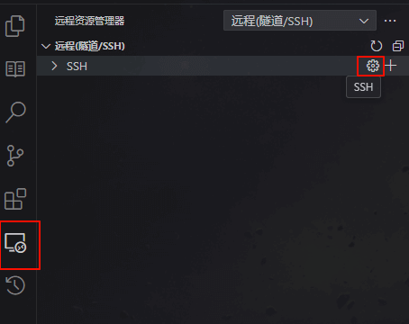
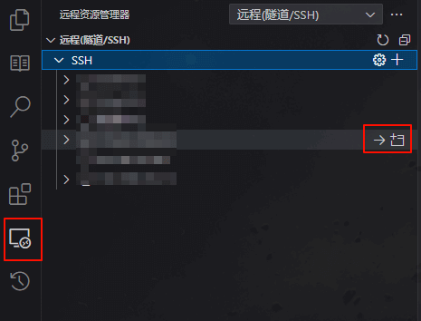
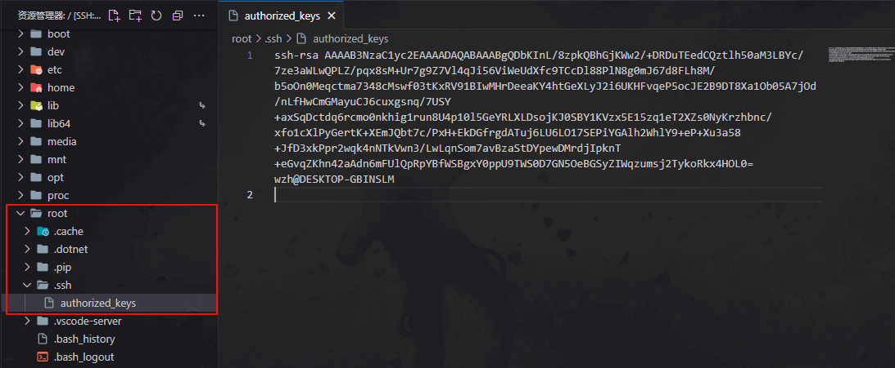

# Vscode 免密连接远程 ssh

## 原理

免密登录需要使用私钥钥和公钥，将公钥放在服务器，私钥放在本机并指明私钥路径即可。

## 生成私钥和公钥

在任意路径(一般为`C:\Users\mjren\.ssh`)的控制台中输入。

```
ssh-keygen
```

将有三次输入:

1. 第一次为私钥公钥的名称，这里为 test。
1. 第二次为密码，这里直接回车没有设置。
1. 第三次为确认密码，没有设置密码直接回车。

如下输出表示生成成功：

```
Generating public/private rsa key pair.
Enter file in which to save the key (C:\Users\mjren/.ssh/id_rsa): test
Enter passphrase (empty for no passphrase):
Enter same passphrase again:
Your identification has been saved in test
Your public key has been saved in test.pub
The key fingerprint is:
SHA256:kYNOdJkjnvV0fsb+YRunmXHBUd1lQYDR9lCKzm9WUTI wzh@DESKTOP-GBINSLM
The key's randomart image is:
+---[RSA 3072]----+
|      . .o .+.E+@|
|     ..o=...o+.=+|
|     .o+++ +.o+..|
|     oo  o+ . ++.|
|      . S  o + ..|
|            . ++o|
|             +.B=|
|            o +..|
|                 |
+----[SHA256]-----+
```

最终会在当前路径下生成私钥文件`test`和公钥文件`test.pub`。

## 将公钥放入服务器

连接远程服务器，这里使用 Vscode，也可以使用其他方式（如 XSheel，服务器浏览器连接等）。

在Vscode中安装插件`Remote-SSH`，安装完成后在`远程资源管理`中打开配置文件。



添加如下配置：

```
Host cosy
  HostName 122.521.21.251
  Port 22
  User root
```

> Host：远程连接的名称。  
> HostName：地址，如果有域名也可以用域名。  
> Port：端口，SSH 为 22 端口，注意服务器是否开启了此端口，是否开启防火墙等。  
> User：为登录用户名。

设置完成后在`远程资源管理`中可以看到添加的服务器并连接。这次连接还是需要密码的。



打开服务器文件，没有的话就创建一个：

```
/root/.ssh/authorized_keys
```

将刚刚生成的公钥文件内容复制到文件中，文件中有内容的话想换行在复制。



## 本机使用私钥

在刚刚的`远程资源管理`配置中追加配置如下：

```
Host cosy
  HostName 122.521.21.251
  Port 22
  User root
  IdentityFile C:\Users\xxx\.ssh\test
```

> IdentityFile：私钥文件路径

至此，以后连接该远程将不在需要密码

## 服务器多个公钥

在需要给服务器配置多个公钥方便多台电脑连接时，可以把私钥同步，也可以在服务器上存放多个公钥。

需要在服务器上存放多个公钥时直接在`/root/.ssh/authorized_keys`文件中换行追加即可。
```
ssh-rsa AAAAB3NzaC1yc2EAAAADAQABAAABgQDbKInL/8zpkQBhGjKWw2/+DRDuTEedCQztlh50aM3LBYc/7ze3aWLwQPLZ/pqx8sM+Ur7g9Z7Vl4qJi56ViWeUdXfc9TCcDl88PlN8g0mJ67d8FLh8M...
ssh-rsa AAAAB3NzaC1yc2EAAAADAQABAAABgQCzOMdL352fvFVpHKt5yFxxYtxWZnVDnghMFT8PB1DE8AMjUrz3BWuyCWPrVQEg5lftA1KOUsnJqBRNcVoi1yWVfSSW2CXLTbY7bjpKDhQ9iLlc8LtNj...
```
这样只要使用其中任意一个对应的私钥都可以进行免密连接。
