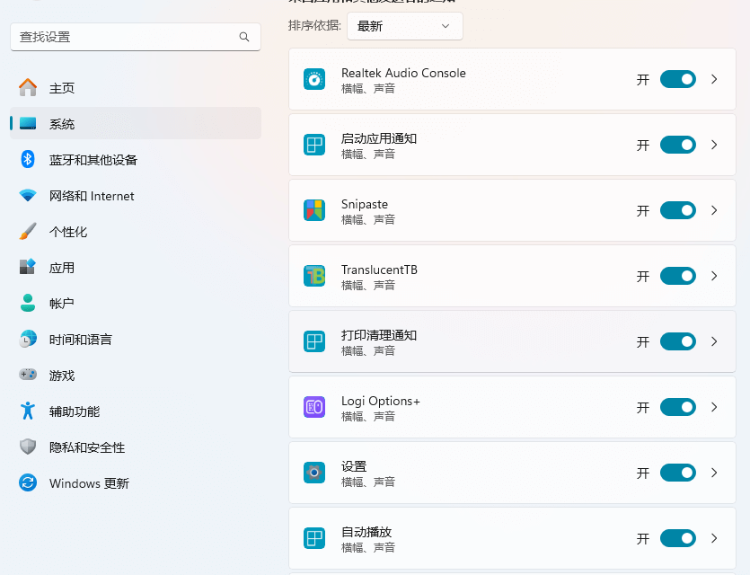
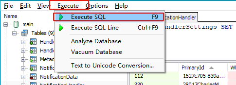
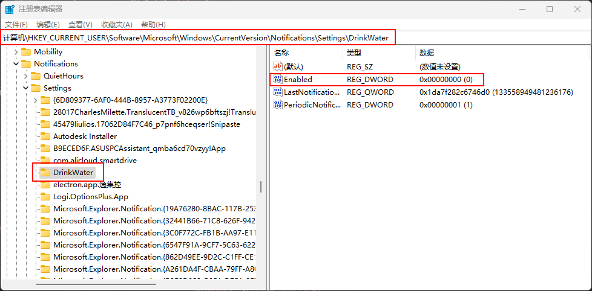

# window 重新打开已经关闭的应用通知

## 引言

在使用个人开发软件 [DrinkWater](https://github.com/cosy247/DrinkWater) 时，不小心关闭了应用的通知。由于该软件没有被系统直接收录在通知管理中，我需要通过其他方式来重新开启通知。以下是我记录的重新打开已关闭应用通知的过程。



## 修改用户数据库数据

1. 文件路径：`C:\Users\用户名\AppData\Local\Microsoft\Windows\Notifications\wpndatabase.db`


注意：C:\Users\用户名\AppData 为隐藏文件夹，可以通过下图设置开启查看隐藏的文件和文件夹


2. 由于 `.db` 文件是数据库文件，需要使用专门的软件来打开。这里使用 [SQLiteSpy](https://www.sqlitespy.com/download.html) ，也可以使用数据库管理工具。以下为 SQLiteSpy 打开上面的`wpndatabase.db`文件后的界面：


3. 点击左边的 `NotificationHandler` 后后边将出现表格，点击 `PrimaryId` 进行排序，找到对应软件的数据行并记录 `RecordId`，这里是 `282`。


4. 在上面空白区域写入

```sql
UPDATE HandlerSettings SET Value=1 WHERE HandlerId=282 AND SettingKey='s:lock:toast'
```

需要将 `282` 替换为你需要修改软件的 `RecordId`。这段代码表示将左边 `HandlerSettings` 表中的 `282` 号软件的 `s:lock:toast` 对应值改为 `1`。`0` 表示关闭，`1` 表示开启。



5. 选择 `Execute > Execute SQL` 执行输入的代码端。可以执行以下代码查看是否更改成功

```sql
SELECT * FROM HandlerSettings WHERE HandlerId=282 AND SettingKey='s:lock:toast'
```

6. 由于 win 版本不同，`SettingKey` 的名称可能不同。win11 为 `s:lock:toast`，win10 为 `s:toast`。在执行上面代码时替换即可，也可以将 `s:lock:toast` 和 `s:toast` 都执行一次。

7. 关闭时出现下面弹窗询问`是否需要保存刚刚运行的代码`，这里选择 No 直接关闭即可。


## 修改注册表的数据

1. 使用组合键`window + r` 打开控制台并输入 `regedit` 打开`注册表编辑器`，或者直接搜索 `注册表编辑器`打开。

2. 导航至以下路径：`HKEY_CURRENT_USER\SOFTWARE\Microsoft\Windows\CurrentVersion\Notifications\Settings`并点击左侧对应软件。



3. 将右方的`Enabled`行进行删除

## 测试

重新打开你的应用并检查通知是否已重新开启。如果仍然没有通知，可以尝试重启电脑后再次检查。
