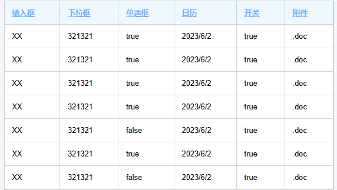
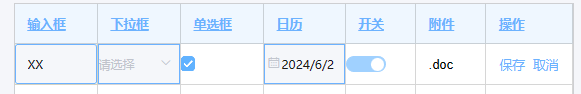

# 可配置的表格Vue组件

## 目的

实现一个通用的表格`Vue`组件，通过对组件的`prop`的控制做到对组件内容的更改。【采用[element-ui](https://element.eleme.cn/#/zh-CN/component/installation)作为 ui】

## 实现简单的一个 table

先对表头和表身的数据分割开来。表头对自身进行描述控制。表身的数据对单元格进行控制。

```html
<template>
    <div class="root-table">
        <div class="table-content">
            <table class="table-content-table" border="0" cellspacing="0">
                <tr>
                    <th v-for="thColumn in ths">{{ thColumn.name }}</th>
                </tr>
                <tr v-for="tdRow in tds">
                    <td v-for="tdColumn in tdRow">{{ tdColumn }}</td>
                </tr>
            </table>
        </div>
    </div>
</template>

<script>
    export default {
        data: () => ({
            ths: [{ name: '输入框' }, { name: '下拉框' }, { name: '单选框' }, { name: '日历' }, { name: '开关' }, { name: '附件' }],
            tds: [
                ['XX', '321321', true, '2023/6/2', true, '.doc', ''],
                ['XX', '321321', true, '2023/6/2', true, '.doc', ''],
                ['XX', '321321', true, '2023/6/2', true, '.doc', ''],
                ['XX', '321321', true, '2023/6/2', true, '.doc', ''],
                ['XX', '321321', false, '2023/6/2', true, '.doc', ''],
                ['XX', '321321', true, '2023/6/2', true, '.doc', ''],
                ['XX', '321321', false, '2023/6/2', true, '.doc', ''],
            ],
        }),
    };
</script>
```

渲染结果：



> `注：css可以在最后的完整代码中查看`

## 实现输入框单元格

目前单元格都是显示的普通文本，需要显示其他的特殊单元格需要添加一个字段`type`用来标识需要显示`input`类型。而其他的默认为`text`类型。

```html
<td v-for="tdColumn in tdRow" :class="getItemClassName(tdColumn)">
    <el-input v-if="tdColumn.type == 'input'" v-model="tdColumn.value" />
    <span v-else>{{ tdColumn.value }}</span>
</td>
```

```js
// 添加处理后的数据
data: () => ({
    // ...
    thData: [],
    tdData: [],
}),
// 对ths和tds进行处理
beforeMount() {
    this.thData = this.ths.map((item) => (typeof item == 'object' ? item : { name: item }));
    this.tdData = this.tds.map((tdRow) =>
        tdRow.map((item, index) => ({
            type: 'text', // 默认添加text类型
            ...this.thData[index], // 将th的数据添加到td中
            ...(typeof item == 'object' ? item : { value: item }), // 将数据替换为object
        }))
    );
},
methods: {
    getItemClassName(column) {
        return {
            [column.type] : true
        }
    }
}
```


对`thData`数据的处理比较简单。对`tdData`的处理过程是将对于列的`th`的配置内容写入到每一个单元格中，在渲染单元格的时候对其中的配置进行判断然后渲染为不同的单元格。当然也可以直接写到对应的单元格配置中，只是控制的权重不同，默认权重小于`th`配置权重小于单元格配置权重。这样方便配置列整体的单元格，也方便对单一单元格的配置进行特殊处理。进行处理后得到的`thData`为一个二维数组：`[[{type, name, value}]]`，其中`name`为列名来着表头，主要用于后面封装时的回调传值。添加`getItemClassName`方法用来设置单元格的类名，方便对单元格样式的控制。

> 表格直接显示输入框显然不符合大多数的业务场景，更多的场景是默认显示普通文本信息，在每一列有编辑按钮，在点击编辑后讲对于的单元格切换为输入框。

## 添加特殊功能按钮

编辑按钮可以看作为一个特殊的控制功能，他需要对表格的其他单元格进行控制，之后还有保存，删除等。我们将这些可以改变其他单元格的功能统一使用`option`这一种`type`来做区分，再使用`option`属性用来表示操作的类型。

```js
data: () => ({
    ths: [
        { name: '输入框', type: 'input' },
        { name: '下拉框' },
        { name: '单选框' },
        { name: '日历' },
        { name: '开关' },
        { name: '附件' },
        { name: '操作', type: 'option', option: '|edit|delete'}
    ],
    tds: [
        ['XX', '321321', true, '2023/6/2', true, '.doc', ''],
        ['XX', '321321', true, '2023/6/2', true, '.doc', ''],
        ['XX', '321321', true, '2023/6/2', true, '.doc', ''],
        ['XX', '321321', true, '2023/6/2', true, '.doc', ''],
        ['XX', '321321', false, '2023/6/2', true, '.doc', ''],
        ['XX', '321321', true, '2023/6/2', true, '.doc', ''],
        ['XX', '321321', false, '2023/6/2', true, '.doc', ''],
    ],
    // ...
}),
```

```html
<tr v-for="(tdRow, rowIndex) in tdData">
    <td v-for="tdColumn in tdRow" :class="getItemClassName(tdColumn)">
        <div v-if="tdColumn.type == 'option'">
            <span v-if="tdColumn.option.includes('|edit')" @click="editRow(tdRow, rowIndex)">编辑</span>
            <span v-if="tdColumn.option.includes('|delete')" @click="deleteRow(tdRow, rowIndex)">删除</span>
            <span v-if="tdColumn.option.includes('|save')" @click="saveRow(tdRow, rowIndex)">保存</span>
            <span v-if="tdColumn.option.includes('|cancel')" @click="cancelRow(tdRow, rowIndex)">取消</span>
        </div>
        <!-- ... -->
    </td>
</tr>
```


编辑按钮用了一个`div`包含起来是为了方便对`option`的显示进行统一管理。使用`includes`来判断是否添加按钮，这样方便一个操作栏中同时配置多个功能按钮。

> 这里只用竖线对名称进行分割，用于避免一个操作为`A`，一个操作为`B`，一个操作为`AB`，无法有效的区分出是`AB`还是`A&B`的情况。当然也可以使用数组代替 option 的值。

## 编辑功能

目前单元格的显示是由单元格的配置决定的，那么在出发特殊按钮时对单元格的配置进行修改即可。添加一个 edit 属性，用于表示编辑时单元格的配置信息。配置不是直接替换，而是使用覆盖的方式，这样单元格之前的部分属性可以得到保留，比如 value。

```html
<div v-if="tdColumn.type == 'option'">
    <span v-if="tdColumn.option.includes('|edit')" @click="editRow(tdRow, rowIndex)">编辑</span>
    <span v-if="tdColumn.option.includes('|delete')" @click="deleteRow(tdRow, rowIndex)">删除</span>
    <span v-if="tdColumn.option.includes('|save')" @click="saveRow(tdRow, rowIndex)">保存</span>
    <span v-if="tdColumn.option.includes('|cancel')" @click="cancelRow(tdRow, rowIndex)">取消</span>
</div>
```

```js
data: () => ({
    ths: [
        { name: '输入框', edit: { type: 'input' } },
        { name: '下拉框' }, { name: '单选框' },
        { name: '日历' }, { name: '开关' },
        { name: '附件' },
        { name: '操作', type: 'option', option: '|edit|delete', edit: { option: '|save|cancel' } }],
    // ...
}),
```

 

其中输入框的`type`默认为`text`可以不写，操作的`type`为`option`，在编辑时`type`不变而把`option`改为保存和取消。在编辑事件中我们只需要把 edit 中的配置释放到外层配置即可。

```js
methods: {
    editRow(rowData, rowIndex) {
        this.$set(this.tdData, rowIndex, rowData.map((item, index) => {
                return {
                    ...item,
                    ...item.edit,
                };
            })
        );
    },
    // ...
}
```

这里对操作行的配置进行统一的修改，将 edit 的内容覆盖追加到配置中，渲染出新的单元格。

## 取消编辑功能

在编辑时，输入框绑定的是单元格的`value`值，那么在取消的时候我们需要对`option`还原的同时还需要对`value`值进行还原。这里需要还原两个属性，但是之后的功能中可能还会有对样式的还原，对类名的还原等，所以不采用手动判断数据的方式去还原数据，而是使用保存初始化信息的方式。在最开始生成单元格配置信息时先对配置信息进行复制一份保存起来，在复原时直接替换对应列的配置即可。

```js
data: () => ({
    // ...
    tdInitData: [],
}),
beforeMount() {
    // ...
    this.tdData = // ...
    this.tdInitData = structuredClone(this.tdData);
},
methods: {
    cancelRow(rowData, rowIndex) {
        this.$set(this.tdData, rowIndex, structuredClone(this.tdInitData[rowIndex]));
    },
    // ...
}
```

> structuredClone：js 提供的结构化数据深拷贝工具函数 [MDN-structuredClone](https://developer.mozilla.org/zh-CN/docs/web/api/structuredClone)

## 保存功能

保存功能和取消功能类似，都需要对配置还原，只是需要对`value`进行保存。同时把`tdInitData`的`value`也更新掉。

```js
methods: {
    saveRow(rowData, rowIndex) {
        this.tdInitData[rowIndex].forEach((item, index) => {
            item.value = rowData[index].value;
        });
        this.$set(this.tdData, rowIndex, structuredClone(this.tdInitData[rowIndex]));
    },
}
```

## 删除功能

删除功能就更加简单了，只要把对应行的数据删除即可。同时把`tdInitData`的对应行也删除。

```js

methods: {
    deleteRow(rowData, rowIndex) {
        this.tdData.splice(rowIndex, 1);
        this.tdInitData.splice(rowIndex, 1);
    },
    // ...
}
```

### 小结

目前已经对单元格的编辑相关功能已经完成，大致思想就是对单元格的配置进行修改以渲染出不同的单元格。当目前属性不足以完成目标功能时对属性进行添加，来保存需要的新属性即可。

### 添加更多的特殊单元格

对应单元格的渲染类型我们使用 type 来控制，目前有默认的 text 和特殊的 input、option。通过添加更多的 type 来区分特殊单元格的类型，并使用 value 进行值保存，在必要时添加更多的属性。

### 添加下拉框

这里使用`select`作为`type`的值，并使用`element-ui`提供的[el-cascader](https://element-plus.org/zh-CN/component/cascader.html)进行渲染，使用`el-cascader`是为了同时兼容多级选择器。并定义一个`typeData`来保存下拉框的数据。

```html
<td v-for="tdColumn in tdRow" :class="getItemClassName(tdColumn)">
    <!-- ... -->
    <el-cascader v-else-if="tdColumn.type == 'select'" :options="tdColumn.typeData" v-model="tdColumn.value" />
    <!-- ... -->
</td>
```

```js
data: () => ({
    tableData: {
        ths: [
            {
                name: '下拉框',
                edit: {
                    type: 'select',
                    typeData: [
                        {
                            value: 22,
                            label: 222,
                            children: [
                                { value: 22, label: 222 },
                                { value: 33, label: 333 },
                            ],
                        },
                        { value: 33, label: 333 },
                    ],
                },
            },
            // ...
        ],
    },
    // ...
});
```

 

可以看到编辑是没有默认的值，是因为我们的 value 没有存在在数据中。但是保存后的 value 是一个数组，直接显示显然不满足我们的期望，那么需要我们对显示的数据进行类型判断来显示合适的。

#### 对文本单元格更新

如果是对类型进行判断显示的话可能还是有些问题。比如刚刚的多级选择框，最后的的值是一个数组，那是显示最后一个值（多级的子选择没有冲突）还是全部显示（多级的子选择有冲突）呢？这显然只判断数据类型不能做到，而是需要添加一个新的属性来规定文本的显示类型。

```html
<span v-else class="text">{{ getShowText(tdColumn) }}</span>
```

```js
data: () => ({
    tableData: {
        ths: [
            {
                name: '下拉框',
                showType: 'array-end',
                // ...
            },
        // ...
        ]
    }
})
methods: {
    getShowText({ showType, value }) {
        if (Object.prototype.toString.call(value) == '[object Array]') {
            if (showType == 'array-end') {
                return this.getShowText({ value: value.at(-1) });
            } else {
                return value.map(item => this.getShowText({value: item})).join('-')
            }
        } else if (Object.prototype.toString.call(value) == '[object Date]') {
            return value.toLocaleDateString();
        } else {
            return value;
        }
    },
}
```


将 showType 设置为其他值时将用横线进行分割


在获取显示文本时还是需要做一次数据类型的判断避免配置错误发生的 bug。在知道是数组时获取到数据后还需要再对其中的数据进行递归一次。再这个问题中可以不采用递归，但是数组中可以为`Date`类型，那么需要进行进一步的处理，在下面的事件选择器中将会遇到这个问题，但是我们已经提前解决了。

## 添加时间选择器

和添加下拉框类似，创建一个新的 type 来表示时间选择器。这里使用[el-date-picker](https://element-plus.org/zh-CN/component/date-picker.html)进行渲染。

```html
<el-date-picker v-else-if="tdColumn.type == 'date'" v-model="tdColumn.value" :type="tdColumn.dateType" format="yyyy/M/d" />
```

```js
data: () => ({
    tableData: {
        ths: [
            { name: '日历', edit: { type: 'date', dateType: 'date' } },
            // ...
        ],
    },
});
```


`el-date-picker` 中有个`type`属性表示选择器类型，我们这里使用`dateType`表示。`dateType`可以不写在`edit`中，因为只有在`type`为`date`是`dateType`还有作用。这里选择后的值为`Date`类型，之前在`getShowText`已经对它处理掉了。

> `el-date-picker`组件根据类型的不一样可以选择单一时间，也可以选择一个时间段。选择单一事件时的`value`为`Date`类型，选择事件段时的`value`为数组`[Date, Date]`


## 添加单选框

单选框有点特殊，因为在编辑和没有编辑时它都应该显示单选框的样式，也就是`type`不变只改变是否可点击。这里添加`diabeld`属性对其控制。

```html
<td v-for="tdColumn in tdRow" :class="getItemClassName(tdColumn)">
    <!-- ... -->
    <el-checkbox v-else-if="tdColumn.type == 'checkbox'" v-model="tdColumn.value" :disabled="tdColumn.disabled" />
    <el-switch v-else-if="tdColumn.type == 'switch'" v-model="tdColumn.value" :disabled="tdColumn.disabled" />
    <!-- ... -->
</td>
```

```js
data: () => ({
    tableData: {
        ths: [
            // ...
            { name: '单选框', type: 'checkbox', disabled: true, edit: { disabled: false } },
            { name: '开关', type: 'switch', disabled: true, edit: { disabled: false } },
        ],
    },
});
```


> 这里只是给单选框和开关添加了 disabled 属性，当然也可以给其他类型的单元格添加这个属性进行统一管理。

## 小结

单元格的类型是由`type`决定的，通过添加`type`类型来添加特殊单元格，再在对应的地方添加上组件即可。在需要更多控制属性时添加额外的属性保存其信息。

## 添加列功能

添加功能可以作为一个特殊功能，因为它也相当于在改变单元格的状态。添加按钮应该不在表格中的已经存在的某一列中，而是单独成一行或者由单独的位置。

```html
<div class="root-table">
    <!-- ... -->
    <div v-if="config.addible && !isAdding" class="table-add">
        <p @click="addRow">新增</p>
    </div>
</div>
```

```js
data: () => ({
    config: {
        addible: true,
    },
    isEditing: false,
    isAdding: false,
    // ...
}),
beforeMount() {
    // ...
    this.addRowData = structuredClone(this.tdData[0]).map((item) => {
        item.value = '';
        return item;
    });
},
methods: {
    // ...
    editRow(rowData, rowIndex) {
        if(this.isEditing) return;
        // ...
    },
    saveRow(rowData, rowIndex) {
        this.isEditing = false;
        if (this.isAdding && rowIndex == this.tdData.length - 1) {
            this.isAdding = false;
        }
        this.tdInitData[rowIndex].forEach((item, index) => {
            item.value = rowData[index].value;
        });
        this.$set(this.tdData, rowIndex, structuredClone(this.tdInitData[rowIndex]));
    },
    cancelRow(rowData, rowIndex) {
        this.isEditing = false;
        if (this.isAdding) {
            this.tdData.pop();
            this.tdInitData.pop();
            this.isAdding = false;
        } else {
            this.$set(this.tdData, rowIndex, structuredClone(this.tdInitData[rowIndex]));
        }
    },
    addRow() {
        if(this.isEditing) return;
        this.isAdding = true;
        this.tdData.push(structuredClone(this.addRowData));
        this.tdInitData.push(structuredClone(this.addRowData));
        const index = this.tdData.length - 1;
        this.editRow(this.tdData[index], index);
    },
},
```


表格是否添加是针对于表格而言的，所以可以添加的判断属性应该不在`tdData `或者`thData`中，这里声名了一个`config`用来对表格的整体描述，用于展示或者隐藏添加按钮。添加一列就是在`tdData`中添加数据，在`beforeMount`中生成添加列的模板，在添加时在数据末尾添加一个模板的复制即可。需要注意的是`tdInitData`也需要添加模板数据，并自动使其处于编辑状态。这里使用`isAdding`属性标识了目前是否在添加，避免多次点击出现多个添加框，并在保存和取消时对`isAdding`进行释放。使用`isEditing`属性表示是否有列在编辑，避免多行数据共同编辑，并在保存和取消时释放。

## 属性必填功能

在编辑时可以有的属性是必须填写的，其样式应该和其他的做区分，在保存时应该判断其是否填写。在单元格的中添加一个 require 表示是否必填。

```js
function isEmptyValue(value) {
    if (Object.prototype.toString.call(value) == '[object Array]') {
        return value.length !== 0;
    } else if (Object.prototype.toString.call(value) == '[object Object]') {
        return Object.keys(value).length !== 0;
    } else if (Object.prototype.toString.call(value) == '[object String]') {
        return value.length !== 0;
    } else if (value === true || value === false) {
        return true;
    } else {
        return false;
    }
}
```

```js
data: () => ({
    ths: [
        { name: '输入框',  edit: { type: 'input', require: true } },
        // ...
    ],
    // ...
})
methods: {
    getItemClassName(column) {
        return {
            [column.type || 'text']: true,
            require: column.require,
        };
    },
    getItemClassName(column) {
        return {
            [column.type || 'text']: true,
            require: column.require,
            stickyLeft: column.position && column.position.includes('left'),
            stickyRight: column.position && column.position.includes('right'),
            search: column.type == 'text' && String(column.value).includes(this.config.search),
        };
    },
    saveRow(rowData, rowIndex) {
        const checkRequire = rowData.some((item) => {
            console.log(item.require, item.value);
            return item.require && !isEmptyValue(item.value);
        });
        if (checkRequire) {
            this.$message.warning('请填写必要字段');
            return;
        }
        // ...
    },
    // ...
}
```


在 getItemClassName 中判断 require 值为单元格添加类名，并编写 css（这里没有写出 css）。在保存时判断是否有必填的单元格没有填写，并在没有完全填写时提示用户。这里判断是否填写单元格单独写了个函数，可以提供给其他地方使用，根据项目的不同可以对函数进行调整。

## 搜索功能

搜索功能核心也是给符合条件的单元格添加样式，这里只对类型为 text 的进行搜索处理。搜索也是对表格整体的改变，搜索的关键词也放在 config 中。

```js
data: () => ({
    config: {
        search: 'ABC',
        // ...
    },
}),
methods: {
    getItemClassName(column) {
        return {
            // ...
            search: column.type == 'text' && String(column.value).includes(this.config.search),
        };
    },
    // ...
}
```


## 对单一单元格进行控制

## 在数据中修改单元格配置

在对单元格预处理时，单元格配置的`type`默认为`text`，然后继承`td`的配置，最后用只身的配置进行覆盖。那么只修改目标单元格的配置即可实现对单一单元格的控制。

```js
data: () => ({
    // ...
    tds: [
        [{ value: true, type: 'switch' }, '321321', true, '2024/6/2', true, '.doc', ''],
        // ...
    ],
});
```


## 通过筛选修改单元格配置

在业务中，可能出现两个字段比如时间和地点，在时间未到时可能修改时间，过时后将不可以修改。通过筛选对符合条件的单元格进行控制修改。这里使用日历为时间，使用`disabled`控制是否可以写，在时间过时后设置为不可写。

```js
data: () => ({
    config: {
        // ...
        setItemConfig(itemConfig, tdRow, rowIndex) {
            if (new Date(tdRow[3].value) > Date.now()) {
                itemConfig.disabled = true;
                itemConfig.edit = {
                    ...itemConfig.edit,
                    disabled: true,
                };
            }
        },
    },
    // ...
}),
beforeMount() {
    this.thData = this.ths.map((item) => (typeof item == 'object' ? item : { name: item }));
    this.tdData = this.tds.map((tdRow, rowIndex) =>
        tdRow.map((item, index) => ({
            type: 'text',
            ...this.thData[index],
            ...(typeof item == 'object' ? item : { value: item }),
        }))
    );
    if (typeof this.config?.setItemConfig == 'function') {
        this.tdData.forEach((tdRow, rowIndex) =>
            tdRow.forEach((itemConfig) => {
                this.config.setItemConfig(itemConfig, tdRow, rowIndex);
            })
        );
    }
    this.tdInitData = structuredClone(this.tdData);
    this.addRowData = structuredClone(this.tdData[0]).map((item) => {
        item.value = '';
        return item;
    });
},
```



在`config`中定义`setItemConfig`函数用户修改单元格的配置，参数为当前作用目标单元格配置，这一行单元格的配置，这一行的下标。

## Props 传递与数据更新

## Props 传递

在次之前都是在组件内定义的数据并渲染，这显然不符合组件的使用形式。其中`tds`，`ths`，`config`可以转为`props`传递。其中`tds`和`ths`可以合并为`tdData`。将当前表格组件命名为`Table.vue`，父级组件命名为`TableDome.vue`

```html
<!--TableDome.vue -->
<template>
    <div class="tableDome-root">
        <table :data="tableData" :config="tableConfig" />
    </div>
</template>

<script>
    // import 引入Table组件;

    export default {
        components: { Table },
        data: () => ({
            tableData: {
                ths: [
                    // ...
                ],
                tds: [
                    // ...
                ],
            },
            tableConfig: {
                // ...
            },
        }),
    };
</script>
```

```js
// Table.vue
props: {
    data: Object,
    config: Object,
},
data: () => ({
    isEditing: false,
    isAdding: false,
    thData: [],
    tdData: [],
    tdInitData: [],
}),
```

> 这样虽然使用了`props`传递参数，但是我们修改`TableDome`中的数据时表格并不会变化，这是因为表格渲染时没有直接使用`props`中的数据，而是在`beforeMount`中生成了自己需要的数据。

## 数据更新

定义一个`props`属性`updateTime`用来监听是否需要重新生成表格的数据。在`TableDome`中修改`data`后同时修改`updateTime`来告诉`Table`需要更新。推荐使用`Date.now()`获取时间戳作为`update`的值。

```js
props: {
    data: Object,
    config: Object,
    updateTime: Number
},
// 删除 beforeMount,
watch: {
    updateTime: {
        handler() {
            // 复制 beforeMount
        },
        immediate: true,
    }
},
```

## 事件回调

## 整体数据回调

在对数据进行修改，添加，删除等存在时往往伴随着接口的调用对数据进行更新。比如保存回调，可以在`config`中定义`onSave`为保存回调，并在保存功能触发时调用即可。

```js
data: () => ({
    config: {
        onSave(rowData, rowIndex, tdValues, vm){
            if(rowIndex != 0) {
                vm.$message.warning('只可以对第一行数据进行保存')
                return false;
            }
            return true;
        },
        // ...
    }
    // ...
}),
computed: {
    tdValues() {
        return this.tdData.map((row) => row.map(({ value }, index) => ({ name: this.thData[index].name, value })));
    },
},
methods: {
    saveRow(rowData, rowIndex) {
        // ...
        // 判断是否有保存回调函数，返回为true时继续执行
        if(typeof this.config?.onSave == 'function') {
            if(!this.config.onSave(rowData, rowIndex, this.tdValues, this)) {
                return;
            }
        }
        this.$set(this.tdData, rowIndex, structuredClone(this.tdInitData[rowIndex]));
    },
}
```


定义计算属性`tdValues`表示表格数据集并将当前组件作为参数传入回调。这里一共传递了 4 个参数，也后续开发中可能会传递更多的属性值，需要根据实际情况更改。

## 单元格事件回调

在一些特殊的情况下，需要对特殊的单元格进行事件绑定。而且不同的组件支持的事件也有所不同。比如输入框支持`change`、`input`、`blur`和`focus`，而`checkbox`只支持`change`就可以了。再定义`events`对象为单元格属性，其中包含需要绑定的事件和函数或函数名。

```html
<td v-for="tdColumn in tdRow" :class="getItemClassName(tdColumn)">
    // ...
    <el-input v-else-if="tdColumn.type == 'input'" v-model="tdColumn.value" :disabled="tdColumn.disabled" @blur="runEvent('blur', tdColumn, rowIndex)" @focus="runEvent('focus', tdColumn, rowIndex)" @input="runEvent('input', tdColumn, rowIndex)" @change="runEvent('change', tdColumn, rowIndex)" />
    // ...
</td>
```

```js
data: () => ({
    tableData: {
        ths: [
            {
                // ...
                events: {
                    change(tdColumn, rowIndex, vm) {},
                },
            },
            // ...
        ]
        // ...
    }
    // ...
})
methods: {
    runEvent(eventName, tdColumn, rowIndex) {
        if (tdColumn.events) {
            if (typeof tdColumn.events[eventName] == 'function') {
                tdColumn.events[eventName](tdColumn, rowIndex, this);
            } else if (typeof tdColumn.events[eventName] == 'string') {
                functionTotal[tdColumn.events[eventName]] && functionTotal[tdColumn.events[eventName]](tdColumn, rowIndex, this);
            }
        }
    },
    // ...
}
```

现在标签中定义出支持的事件，这里实例给出了`input`的事件，其他类型单元格类似。事件都通过`runEvent`处理，先查看单元格的`events`下是否有对应的事件函数可以调用，再到统一定义函数集合`functionTotal`中查找，这里省略了引入。

> 事件指定的可以是一个函数，也可以是一个在统一定义函数集合中的一个函数名。统一定义函数集合用来管理一些特殊的函数集合。

## 参数说明

目前组件有三个参数：`updateTime`用于控制数据更新，`tableData`用于控制数据展示，`config`用于控制表格的整体修改。

## updateTime

表格数据更新标识，在父组件数据更新后需要改变`updateTime`来让`Tabel`组件进行更新；推荐使用时间戳。

## data

`data`为表格的数据展示配置，其中分为`ths`和`tds`分别控制表头和表身。

```js
data = {
    ths: [
        {
            /** 列名 */
            name: '下拉框',
            /** 单元格类型，默认为text文本类型 */
            type: 'select',
            /** text文本显示类型 */
            showType: 'array-all',
            /** 复杂单元格的数据，比如保存下拉框中的数据 */
            typeData: any,
            /** 单元格是否可用 */
            disabled: true,
            /** 是否必填，在保存时将会判断 */
            require: true，
            /** option类型的值，竖线开头（|edit|delete|save|cancel） */
            option: '|edit|delete'，
            /** 编辑时替换的属性 */
            edit: {},
            /** 绑定事件 */
            events: {
                /** 定义change事件并传入执行函数（当前单元格配置，行序号，组件实例） */
                change(tdColumn, rowIndex, vm) {},
                /** 定义input事件并传入函数名（当前单元格配置，行序号，组件实例） */
                input: 'functionName',
            }
        },
    ],
    tds: [
        [
            /** 使用普通类型作为value将会转化为：{value: '321321', type: 'text'} */
            '321321',
            /** type默认为text：{value: 'XX', type: 'text'} */
            { value: 'XX'},
            /** 对当前单元格控制为不可用 */
            { value: '2023/6/2', disabled: false },
        ],
    ],
}
```

tds 中的单元格配置将默认继承同一列的 ths 配置，例如第三个继承后：

```js
td = {
    name: '下拉框',
    type: 'select',
    value: '2023/6/2',
    showType: 'array-all',
    typeData: any,
    disabled: false,
    require: true，
    option: '|edit|delete'，
    edit: {},
}
```

## config

cofnig 中为表格的整体配置，通常是一些特殊处理

```js
config = {
    /** 是否显示新增按钮 */
    addible: true,
    /** 搜索关键词 */
    search: 'ABC',
    /**
     * @description: 保存回调
     * @param {Array} rowData: 当前行value值
     * @param {Number} rowIndex: 行序号
     * @param {Array} tdValues: 表格全部value值
     * @param {Vue} vm: 表格实例
     * @return {boolean} : 返回true表示可以保存
     */
    onSave(rowData, rowIndex, tdValues, vm){},
    /**
     * @description: 修改参数itemConfig控制每个单元格
     * @param {itemConfig} : 当前单元格格式化配置
     * @param {tdRow} : 行数据格式化配置
     * @param {rowIndex} : 行序号
     * @param {vm} : 表格实例
     */
    setItemConfig(itemConfig, tdRow, rowIndex, vm) {},
},
```

## 总结

对表格的改变可以分为对单元格的改变和对表格整体的改变。如果是对单元格的改变只需要对单元格的配置信息进行修改即可，对表格整体的改变则需要在 config 中添加对应的控制属性并在合适的时候添加或者修改组件的标签属性内容。

## 完整代码

> 需要先引入 element-ui 使用`/deep/`对`element-ui`组件内部样式进行修改。

```html
<!-- Table.vue -->
<template>
    <div class="root-table">
        <div class="table-content">
            <table class="table-content-table" border="0" cellspacing="0">
                <tr>
                    <th v-for="thColumn in thData">{{ thColumn.name }}</th>
                </tr>
                <tr v-for="(tdRow, rowIndex) in tdData">
                    <td v-for="tdColumn in tdRow" :class="getItemClassName(tdColumn)">
                        <div v-if="tdColumn.type == 'option'">
                            <span v-if="tdColumn.option.includes('|edit')" @click="editRow(tdRow, rowIndex)">编辑</span>
                            <span v-if="tdColumn.option.includes('|delete')" @click="deleteRow(tdRow, rowIndex)">删除</span>
                            <span v-if="tdColumn.option.includes('|save')" @click="saveRow(tdRow, rowIndex)">保存</span>
                            <span v-if="tdColumn.option.includes('|cancel')" @click="cancelRow(tdRow, rowIndex)">取消</span>
                        </div>
                        <el-input v-else-if="tdColumn.type == 'input'" v-model="tdColumn.value" :disabled="tdColumn.disabled" @blur="runEvent('blur', tdColumn, rowIndex)" @focus="runEvent('focus', tdColumn, rowIndex)" @input="runEvent('input', tdColumn, rowIndex)" @change="runEvent('change', tdColumn, rowIndex)" />
                        <el-date-picker v-else-if="tdColumn.type == 'date'" v-model="tdColumn.value" :type="tdColumn.dateType" format="yyyy/M/d" :disabled="tdColumn.disabled" @blur="runEvent('blur', tdColumn, rowIndex)" @focus="runEvent('focus', tdColumn, rowIndex)" @change="runEvent('change', tdColumn, rowIndex)" />
                        <el-cascader v-else-if="tdColumn.type == 'select'" :options="tdColumn.typeData" v-model="tdColumn.value" :disabled="tdColumn.disabled" @blur="runEvent('blur', tdColumn, rowIndex)" @focus="runEvent('focus', tdColumn, rowIndex)" @change="runEvent('change', tdColumn, rowIndex)" />
                        <el-checkbox v-else-if="tdColumn.type == 'checkbox'" v-model="tdColumn.value" :disabled="tdColumn.disabled" @change="runEvent('change', tdColumn, rowIndex)" />
                        <el-switch v-else-if="tdColumn.type == 'switch'" v-model="tdColumn.value" :disabled="tdColumn.disabled" @change="runEvent('change', tdColumn, rowIndex)" />
                        <span v-else class="text">{{ getShowText(tdColumn) }}</span>
                    </td>
                </tr>
            </table>
        </div>
        <div v-if="config.addible && !isAdding" class="table-add">
            <p @click="addRow">新增</p>
        </div>
    </div>
</template>

<script>
    import { deepClone } from '@/common/utils/public';
    import functionTotal from '@/special/out';

    function isEmptyValue(value) {
        if (Object.prototype.toString.call(value) == '[object Array]') {
            return value.length !== 0;
        } else if (Object.prototype.toString.call(value) == '[object Object]') {
            return Object.keys(value).length !== 0;
        } else if (Object.prototype.toString.call(value) == '[object String]') {
            return value.length !== 0;
        } else if (value === true || value === false) {
            return true;
        } else {
            return false;
        }
    }

    export default {
        props: {
            data: Object,
            config: Object,
            updateTime: Number,
        },
        data: () => ({
            isEditing: false,
            isAdding: false,
            thData: [],
            tdData: [],
            tdInitData: [],
        }),
        beforeMount() {},
        computed: {
            tdValues() {
                return this.tdData.map((row) => row.map(({ value }, index) => ({ name: this.thData[index].name, value })));
            },
        },
        watch: {
            updateTime: {
                handler() {
                    this.thData = this.data.ths.map((item) => (typeof item == 'object' ? item : { name: item }));
                    this.tdData = this.data.tds.map((tdRow, rowIndex) =>
                        tdRow.map((item, index) => ({
                            type: 'text',
                            ...this.thData[index],
                            ...(typeof item == 'object' ? item : { value: item }),
                        }))
                    );
                    if (typeof this.config?.setItemConfig == 'function') {
                        this.tdData.forEach((tdRow, rowIndex) =>
                            tdRow.forEach((itemConfig) => {
                                this.config.setItemConfig(itemConfig, tdRow, rowIndex);
                            })
                        );
                    }
                    this.tdInitData = deepClone(this.tdData);
                    if (this.tdData[0]) {
                        this.addRowData = deepClone(this.tdData[0]).map((item) => {
                            item.value = '';
                            return item;
                        });
                    }
                },
                immediate: true,
            },
        },
        methods: {
            getShowText({ showType, value }) {
                if (Object.prototype.toString.call(value) == '[object Array]') {
                    if (showType == 'array-end') {
                        return this.getShowText({ value: value.at(-1) });
                    } else {
                        return value.map((item) => this.getShowText({ value: item })).join('-');
                    }
                } else if (Object.prototype.toString.call(value) == '[object Date]') {
                    return value.toLocaleDateString();
                } else {
                    return value;
                }
            },
            getItemClassName(column) {
                return {
                    [column.type]: true,
                    require: column.require,
                    search: column.type == 'text' && String(column.value).includes(this.config.search),
                };
            },
            getEvents(tdColumn) {
                console.log(tdColumn);
            },
            runEvent(eventName, tdColumn, rowIndex) {
                if (tdColumn.events) {
                    if (typeof tdColumn.events[eventName] == 'function') {
                        tdColumn.events[eventName](tdColumn, rowIndex, this);
                    } else if (typeof tdColumn.events[eventName] == 'string') {
                        functionTotal[tdColumn.events[eventName]] && functionTotal[tdColumn.events[eventName]](tdColumn, rowIndex, this);
                    }
                }
            },
            editRow(rowData, rowIndex) {
                if (this.isEditing) {
                    this.$message.warning('请先完成当前编辑');
                    return;
                }
                this.isEditing = true;
                this.$set(
                    this.tdData,
                    rowIndex,
                    rowData.map((item, index) => {
                        return {
                            ...item,
                            ...item.edit,
                        };
                    })
                );
            },
            deleteRow(rowData, rowIndex) {
                this.tdData.splice(rowIndex, 1);
                this.tdInitData.splice(rowIndex, 1);
            },
            saveRow(rowData, rowIndex) {
                this.isEditing = false;
                const checkRequire = rowData.some((item) => {
                    return item.require && !isEmptyValue(item.value);
                });
                if (checkRequire) {
                    this.$message.warning('请填写必要字段');
                    return;
                }
                if (this.isAdding && rowIndex == this.tdData.length - 1) {
                    this.isAdding = false;
                }
                this.tdInitData[rowIndex].forEach((item, index) => {
                    item.value = rowData[index].value;
                });
                // 判断是否有保存回调函数，返回为true时继续执行
                if (typeof this.config?.onSave == 'function') {
                    if (!this.config.onSave(rowData, rowIndex, this.tdValues, this)) {
                        return;
                    }
                }
                this.$set(this.tdData, rowIndex, deepClone(this.tdInitData[rowIndex]));
            },
            cancelRow(rowData, rowIndex) {
                this.isEditing = false;
                if (this.isAdding) {
                    this.tdData.pop();
                    this.tdInitData.pop();
                    this.isAdding = false;
                } else {
                    this.$set(this.tdData, rowIndex, deepClone(this.tdInitData[rowIndex]));
                }
            },
            addRow() {
                if (this.isEditing) {
                    this.$message.warning('请先完成当前编辑');
                    return;
                }
                this.isAdding = true;
                this.tdData.push(deepClone(this.addRowData));
                this.tdInitData.push(deepClone(this.addRowData));
                const index = this.tdData.length - 1;
                this.editRow(this.tdData[index], index);
            },
        },
    };
</script>

<style scoped>
    .root-table {
        position: relative;
        width: 100%;
        border: 1px solid #3333;
    }
    .table-content {
        width: 100%;
        overflow: auto;
    }
    .table-content-table {
        width: 100%;
        font-size: 16px;
        border: #0a9;
    }
    .table-content-table th {
        height: 50px;
        width: 0%;
        color: #6cb2ff;
        text-align: left;
        text-decoration: underline;
        background: #eff7ff;
        border-right: 1px solid #3333;
        border-bottom: 1px solid #3333;
        white-space: nowrap;
        padding: 0 1em;
    }
    .table-content-table td {
        height: 50px;
        padding: 0;
        background: white;
        border-right: 1px solid #3333;
        border-bottom: 1px solid #3333;
        white-space: nowrap;
    }
    .table-content-table td.search {
        background: #f9fada;
    }
    .table-content-table td.require {
        background: #fffbe6;
    }
    .table-content-table .stickyLeft {
        position: sticky;
        left: 0;
        z-index: 99;
    }
    .table-add {
        width: 100%;
        height: 50px;
        line-height: 50px;
        background: white;
    }
    .table-add p {
        margin: 0 auto;
        width: fit-content;
        cursor: pointer;
        color: #6cb2ff;
        border-top: 1px solid #3333;
    }
    /* type == option */
    .table-content-table th.option {
        text-align: center;
    }
    .table-content-table td.option > * {
        display: flex;
        justify-content: center;
        color: #6cb2ff;
    }
    /deep/ .table-content-table td.option > * > span {
        margin: 0 5px;
        white-space: nowrap;
        cursor: pointer;
    }
    /* type == link */
    .table-content-table td.link > * {
        color: #6cb2ff;
        cursor: pointer;
    }
    /* type == input */
    .table-content-table td.input > * {
        width: 100%;
        height: 100%;
        background: transparent;
    }
    /deep/ .table-content-table td.input > * .el-input__inner {
        width: 100%;
        height: 100%;
        border: 1px #6cb2ff solid;
        box-sizing: border-box;
        background: transparent;
        border-radius: 0;
    }
    /* type == select */
    /deep/ .table-content-table td.select .el-input__inner {
        width: 100%;
        height: 50px;
        line-height: 50px;
        padding: 0;
        border-radius: 0px;
        border: 1px #6cb2ff solid;
        box-sizing: border-box;
        background: transparent;
    }
    /* type == date */
    /deep/ .table-content-table td.date .el-input__inner {
        /* width: ; */
        height: 50px;
        padding: 0;
        text-indent: 1.5em;
        border-radius: 0px;
        border: 1px #6cb2ff solid;
        box-sizing: border-box;
        background: transparent;
    }
    /deep/ .table-content-table td.date .el-input__prefix {
        left: 0;
    }
    /* type == text */
    .table-content-table td.text {
        text-indent: 1em;
    }
</style>
```

```html
<!-- TableDome.vue -->
<template>
    <div class="tableDome-root">
        <table :data="tableData" :config="tableConfig" :updateTime="updateTime" />
    </div>
</template>

<script>
    import Table from '@/components/Table.vue';

    export default {
        components: { Table },
        data: () => ({
            updateTime: Date.now(),
            tableData: {
                ths: [
                    {
                        name: '输入框',
                        edit: { type: 'input', require: true },
                        events: {
                            change(...ddd) {
                                console.log(ddd, '输入框');
                            },
                        },
                    },
                    {
                        name: '下拉框',
                        showType: 'array-all',
                        edit: {
                            type: 'select',
                            typeData: [
                                {
                                    value: 22,
                                    label: 222,
                                    children: [
                                        { value: 22, label: 222 },
                                        { value: 33, label: 333 },
                                    ],
                                },
                                { value: 33, label: 333 },
                            ],
                        },
                        events: {
                            change(...ddd) {
                                console.log(ddd, '下拉框');
                            },
                        },
                    },
                    { name: '单选框', type: 'checkbox', disabled: true, edit: { disabled: false } },
                    { name: '日历', edit: { type: 'date' } },
                    { name: '开关', type: 'switch', disabled: true, edit: { disabled: false } },
                    { name: '附件' },
                    { name: '操作', type: 'option', option: '|edit|delete', edit: { option: '|save|cancel' } },
                ],
                tds: [
                    ['XX', '321321', true, '2024/6/2', true, '.doc', ''],
                    ['XX', '321321', true, '2023/6/2', true, '.doc', ''],
                    ['XX', '321321', true, '2023/6/2', true, '.doc', ''],
                    ['XX', '321321', true, '2024/6/2', true, '.doc', ''],
                    ['XX', '321321', false, '2023/6/2', true, '.doc', ''],
                    ['XX', '321321', true, { value: '2023/6/2', disabled: false }, true, '.doc', ''],
                    ['XX', '321321', false, '2023/6/2', true, '.doc', ''],
                ],
            },
            tableConfig: {
                addible: true,
                search: 'ABC',
                onSave(rowData, rowIndex, tdValues, vm) {
                    console.log(rowData, rowIndex, tdValues, vm);
                    if (rowIndex != 0) {
                        vm.$message.warning('只可以对第一行数据进行保存');
                        return false;
                    }
                    return true;
                },
                getItemConfig(itemConfig, tdRow, rowIndex) {
                    if (new Date(tdRow[3].value) > Date.now()) {
                        itemConfig.disabled = true;
                        itemConfig.edit = {
                            ...itemConfig.edit,
                            disabled: true,
                        };
                    }
                },
            },
        }),
    };
</script>

<style>
    .tableDome-root {
        width: 700px;
        margin: 200px auto;
    }
</style>
```
