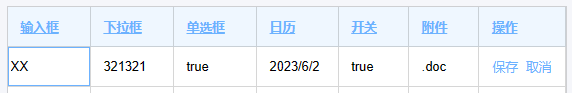
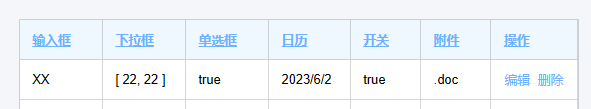
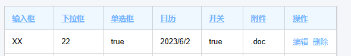

# 目的

实现一个通用的表格 Vue 组件，通过对组件的 prop 的控制做到对组件内容的更改。【采用 element-ui 作为 ui】

# 实现简单的一个 table

先对表头和表体的数据分割开来。表头对自身进行描述控制。表体的数据对单元格进行控制。

```html
<template>
    <div class="root-table">
        <div class="table-content">
            <table class="table-content-table" border="0" cellspacing="0">
                <tr>
                    <th v-for="thColumn in ths">{{ thColumn.name }}</th>
                </tr>
                <tr v-for="tdRow in tds">
                    <td v-for="tdColumn in tdRow">{{ tdColumn }}</td>
                </tr>
            </table>
        </div>
    </div>
</template>

<script>
    export default {
        data: () => ({
            ths: [{ name: '输入框' }, { name: '下拉框' }, { name: '单选框' }, { name: '日历' }, { name: '开关' }, { name: '附件' }],
            tds: [
                ['XX', '信息管理员', '22', true, '2023/6/2', true],
                ['XX', '信息管理员', '赵平', true, '2023/6/2', true],
                ['XX', '信息管理员', '赵平', true, '2023/6/2', true],
                ['XX', '信息管理员', '赵平', true, '2023/6/2', true],
                ['XX', '信息管理员', '赵平', false, '2023/6/2', true],
                ['XX', '信息管理员', '赵平', true, '2023/6/2', true],
                ['XX', '信息管理员', '赵平', false, '2023/6/2', true],
            ],
        }),
    };
</script>
```

渲染结果：


> `注：没有写入css`

# 实现输入框单元格

目前单元格都是显示的普通文本，需要显示其他的特殊单元格需要添加一个字段`type`用来标识需要显示`input`类型。而其他的默认为`text`类型。

```html
<td v-for="tdColumn in tdRow" :class="getItemClassName(tdColumn)">
    <input v-if="tdColumn.type == 'input'" type="text" v-model="tdColumn.value" />
    <span v-else>{{ tdColumn.value }}</span>
</td>
```

```js
// 添加处理后的数据
data: () => ({
    // ...
    thData: [],
    tdData: [],
}),

// 对ths和tds进行处理
beforeMount() {
    this.thData = this.ths.map((item) => (typeof item == 'object' ? item : { name: item }));
    this.tdData = this.tds.map((tdRow) =>
        tdRow.map((item, index) => ({
            type: 'text', // 默认添加text类型
            ...this.thData[index], // 将th的数据添加到td中
            ...(typeof item == 'object' ? item : { value: item }), // 将数据替换为object
        }))
    );
},

methods: {
    getItemClassName(column) {
        return {
            [column.type] : true
        }
    }
}
```


对`thData`数据的处理比较简单。对`tdData`的处理过程是将对于列的 th 的配置内容写入到每一个单元格中，在渲染单元格的时候对其中的配置进行判断然后渲染为不同的单元格。当然也可以直接写到对应的单元格配置中，只是控制的权重不同，默认权重小于 th 配置权重小于单元格配置权重。这样方便配置列整体的单元格，也方便对单一单元格的配置进行特殊处理。进行处理后得到的`thData`为一个二维数组：`[[{type, name, value}]]`，其中`name`为列名来着表头，主要用于后面封装时的回调传值。添加`getItemClassName`方法用来设置单元格的类名，方便对单元格样式的控制。

> 表格直接显示输入框显然不符合大多数的业务场景，更多的场景是默认显示普通文本信息，在每一列有编辑按钮，在点击编辑后讲对于的单元格切换为输入框。

# 添加特殊功能按钮

编辑按钮可以看作为一个特殊的控制功能，他需要对表格的其他单元格进行控制，之后还有保存，删除等。我们将这些可以改变其他单元格的功能统一使用`option`这一种`type`来做区分，再使用`option`属性用来表示操作的类型。

```js
data: () => ({
    ths: [
        { name: '输入框', type: 'input' },
        { name: '下拉框' },
        { name: '单选框' },
        { name: '日历' },
        { name: '开关' },
        { name: '附件' },
        { name: '操作', type: 'option', option: '|edit|delete'}
    ],
    tds: [
        ['XX', '321321', true, '2023/6/2', true, '.doc', ''],
        ['XX', '321321', true, '2023/6/2', true, '.doc', ''],
        ['XX', '321321', true, '2023/6/2', true, '.doc', ''],
        ['XX', '321321', true, '2023/6/2', true, '.doc', ''],
        ['XX', '321321', false, '2023/6/2', true, '.doc', ''],
        ['XX', '321321', true, '2023/6/2', true, '.doc', ''],
        ['XX', '321321', false, '2023/6/2', true, '.doc', ''],
    ],
    // ...
}),
```

```html
<tr v-for="(tdRow, rowIndex) in tdData">
    <td v-for="tdColumn in tdRow" :class="getItemClassName(tdColumn)">
        <div v-if="tdColumn.type == 'option'">
            <span v-if="tdColumn.option.includes('|edit')" @click="editRow(tdRow, rowIndex)">编辑</span>
            <span v-if="tdColumn.option.includes('|delete')" @click="deleteRow(tdRow, rowIndex)">删除</span>
            <span v-if="tdColumn.option.includes('|save')" @click="saveRow(tdRow, rowIndex)">保存</span>
            <span v-if="tdColumn.option.includes('|cancel')" @click="cancelRow(tdRow, rowIndex)">取消</span>
        </div>
        <!-- ... -->
    </td>
</tr>
```


编辑按钮用了一个`div`包含起来是为了方便对`option`的显示进行统一管理。使用`includes`来判断是否添加按钮，这样方便一个操作栏中同时配置多个功能按钮。

> 这里只用竖线对名称进行分割，用于避免一个操作为`A`，一个操作为`B`，一个操作为`AB`，无法有效的区分出是`AB`还是`A&B`的情况。当然也可以使用数组代替 option 的值。

## 编辑功能

目前单元格的显示是由单元格的配置决定的，那么在出发特殊按钮时对单元格的配置进行修改即可。添加一个 edit 属性，用于表示编辑时单元格的配置信息。配置不是直接替换，而是使用覆盖的方式，这样单元格之前的部分属性可以得到保留，比如 value。

```html
<div v-if="tdColumn.type == 'option'">
    <span v-if="tdColumn.option.includes('|edit')" @click="editRow(tdRow, rowIndex)">编辑</span>
    <span v-if="tdColumn.option.includes('|delete')" @click="deleteRow(tdRow, rowIndex)">删除</span>
    <span v-if="tdColumn.option.includes('|save')" @click="saveRow(tdRow, rowIndex)">保存</span>
    <span v-if="tdColumn.option.includes('|cancel')" @click="cancelRow(tdRow, rowIndex)">取消</span>
</div>
```

```js
data: () => ({
    ths: [
        { name: '输入框', edit: { type: 'input' } },
        { name: '下拉框' }, { name: '单选框' },
        { name: '日历' }, { name: '开关' },
        { name: '附件' },
        { name: '操作', type: 'option', option: '|edit|delete', edit: { option: '|save|cancel' } }],
    // ...
}),
```

 

其中输入框的`type`默认为`text`可以不写，操作的`type`为`option`，在编辑时`type`不变而把`option`改为保存和取消。在编辑事件中我们只需要把 edit 中的配置释放到外层配置即可。

```js
methods: {
    editRow(rowData, rowIndex) {
        this.$set(this.tdData, rowIndex, rowData.map((item, index) => {
                return {
                    ...item,
                    ...item.edit,
                };
            })
        );
    },
    // ...
}
```

这里对操作行的配置进行统一的修改，将 edit 的内容覆盖追加到配置中，渲染出新的单元格。

## 取消编辑功能

在编辑时，输入框绑定的是单元格的`value`值，那么在取消的时候我们需要对`option`还原的同时还需要对`value`值进行还原。这里需要还原两个属性，但是之后的功能中可能还会有对样式的还原，对类名的还原等，所以不采用手动判断数据的方式去还原数据，而是使用保存初始化信息的方式。在最开始生成单元格配置信息时先对配置信息进行复制一份保存起来，在复原时直接替换对应列的配置即可。

```js
data: () => ({
    // ...
    tdInitData: [],
}),
beforeMount() {
    // ...
    this.tdData = // ...
    this.tdInitData = structuredClone(this.tdData);
},
methods: {
    cancelRow(rowData, rowIndex) {
        this.$set(this.tdData, rowIndex, structuredClone(this.tdInitData[rowIndex]));
    },
    // ...
}
```

> structuredClone：js 提供的结构化数据深拷贝工具函数 [MDN-structuredClone](https://developer.mozilla.org/zh-CN/docs/web/api/structuredClone)

## 保存功能

保存功能和取消功能类似，都需要对配置还原，只是需要对`value`进行保存。同时把`tdInitData`的`value`也更新掉。

```js
methods: {
    saveRow(rowData, rowIndex) {
        this.tdInitData[rowIndex].forEach((item, index) => {
            item.value = rowData[index].value;
        });
        this.$set(this.tdData, rowIndex, structuredClone(this.tdInitData[rowIndex]));
    },
}
```

## 删除功能

删除功能就更加简单了，只要把对应行的数据删除即可。同时把`tdInitData`的对应行也删除。

```js

methods: {
    deleteRow(rowData, rowIndex) {
        this.tdData.splice(rowIndex, 1);
        this.tdInitData.splice(rowIndex, 1);
    },
    // ...
}
```

## 小结

目前已经对单元格的编辑相关功能已经完成，大致思想就是对单元格的配置进行修改以渲染出不同的单元格。当目前属性不足以完成目标功能时对属性进行添加，来保存需要的新属性即可。

# 添加更多的特殊单元格

对应单元格的渲染类型我们使用 type 来控制，目前有默认的 text 和特殊的 input、option。通过添加更多的 type 来区分特殊单元格的类型，并使用 value 进行值保存，在必要时添加更多的属性。

## 添加下拉框

这里使用`select`作为`type`的值，并使用`element-ui`提供的[el-cascader](https://element-plus.org/zh-CN/component/cascader.html)进行渲染，使用`el-cascader`是为了同时兼容多级选择器。并定义一个`typeData`来保存下拉框的数据。

```html
<td v-for="tdColumn in tdRow" :class="getItemClassName(tdColumn)">
    <!-- ... -->
    <el-cascader v-else-if="tdColumn.type == 'select'" :options="tdColumn.typeData" v-model="tdColumn.value" />
    <!-- ... -->
</td>
```

```js
data: () => ({
    tableData: {
        ths: [
            {
                name: '下拉框',
                edit: {
                    type: 'select',
                    typeData: [
                        {
                            value: 22,
                            label: 222,
                            children: [
                                { value: 22, label: 222 },
                                { value: 33, label: 333 },
                            ],
                        },
                        { value: 33, label: 333 },
                    ],
                },
            },
            // ...
        ],
    },
    // ...
});
```

 

可以看到编辑是没有默认的值，是因为我们的 value 没有存在在数据中。但是保存后的 value 是一个数值，直接显示显然不满足我们的期望，那么需要我们对显示的数据进行类型判断来显示合适的。

## 对文本单元格更新

如果是对类型进行判断显示的话可能还是有些问题。比如刚刚的多级选择框，最后的的值是一个数组，那是显示最后一个值（多级的子选择没有冲突）还是全部显示（多级的子选择有冲突）呢？这显然只判断数据类型不能做到，而是需要添加一个新的属性来规定文本的显示类型。

```html
<span v-else class="text">{{ getShowText(tdColumn) }}</span>
```

```js
data: () => ({
    tableData: {
        ths: [
            {
                name: '下拉框',
                showType: 'array-end',
                // ...
            },
        // ...
        ]
    }
})
methods: {
    getShowText({ showType, value }) {
        if (Object.prototype.toString.call(value) == '[object Array]') {
            if (showType == 'array-end') {
                return this.getShowText({ value: value.at(-1) });
            } else {
                return value.map(item => this.getShowText({value: item})).join('-')
            }
        } else if (Object.prototype.toString.call(value) == '[object Date]') {
            return value.toLocaleDateString();
        } else {
            return value;
        }
    },
}
```



将 showType 设置为其他值时将用横线进行分割


在获取显示文本时还是需要做一次数据类型的判断避免配置错误发生的 bug。在知道是数组时获取到数据后还需要再对其中的数据进行递归一次。再这个问题中可以不采用递归，但是数组中可以为 Date 类型，那么需要进行进一步的处理，在下面的事件选择器中将会遇到这个问题，但是我们已经提前解决了。

## 添加时间选择器

和添加下拉框类似，创建一个新的 type 来表示时间选择器。这里使用[el-date-picker](https://element-plus.org/zh-CN/component/date-picker.html)进行渲染。

```html
<el-date-picker v-else-if="tdColumn.type == 'date'" v-model="tdColumn.value" :type="tdColumn.dateType" format="yyyy/M/d" />
```

```js
data: () => ({
    tableData: {
        ths: [
            { name: '日历', edit: { type: 'date', dateType: 'date' } },
            // ...
        ],
    },
});
```


el-date-picker 中有个type属性表示选择器类型，我们这里使用dateType表示。dateType可以不写在edit中，因为只有在type为date是dateType还有作用。这里选择后的值为Date类型，我们的getShowText已经对它处理掉了。