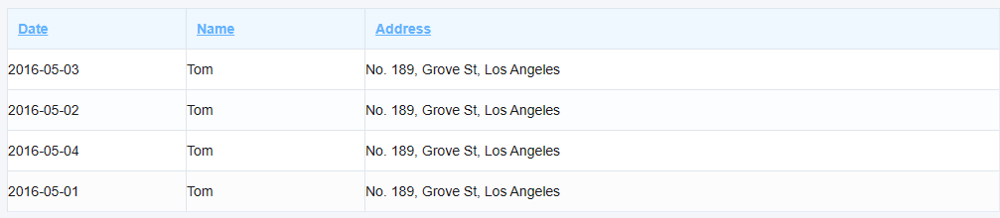

# 目的

实现一个通用的表格Vue组件，通过对组件的prop的控制做到对组件内容的更改。【采用element-ui作为ui】

# 主要功能

1. 表格的单元格可以被定制成普通文本，输入框，下拉框，图片，操作等。
1. 可以对列进行添加，删除和编辑。
1. 支持搜索功能，对满足搜索的单元格进行高亮显示。

# 实现

## 实现简单的一个table

先对表头和表体的数据分割开来。表头对自身进行描述控制，也对同一列的单元格进行控制。表体的数据对单元格进行控制。

```vue
<template>
    <el-table :data="tableData" border style="width: 100%">
        <el-table-column prop="date" label="Date" width="180" />
        <el-table-column prop="name" label="Name" width="180" />
        <el-table-column prop="address" label="Address" />
    </el-table>
</template>

<script lang="ts" setup>
    const tableData = [
        {
            date: '2016-05-03',
            name: 'Tom',
            address: 'No. 189, Grove St, Los Angeles',
        },
        {
            date: '2016-05-02',
            name: 'Tom',
            address: 'No. 189, Grove St, Los Angeles',
        },
        {
            date: '2016-05-04',
            name: 'Tom',
            address: 'No. 189, Grove St, Los Angeles',
        },
        {
            date: '2016-05-01',
            name: 'Tom',
            address: 'No. 189, Grove St, Los Angeles',
        },
    ];
</script>
```
渲染效果



对于一个表格，可以分为表头和表体；表头可用